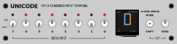

# UNICODE Input Terminal



Classic binary data entry meets modern Unicode: 144K characters at your
fingertips. A physical user interface to enter any UTF-8 sequence over USB.

A display shows a preview of the selected glyph(s), along with metadata about
the codepoint - all rendered entirely on-device. About 30MB of font files are
required to render glyphs, which are read from an SD card.

See the [Hackaday project page]() for more detail about the build.


## Getting started

Parts and wiring can be found in the schematic. The gist is:

 - Raspberry Pi Pico
 - A bunch of switches (8x latching toggle, 1x 3-position momentary, 1x 2-position momentary)
 - ST7789 based display (ideally 240x300, but other resolutions could be made to work)
 - SD card receptacle of some form that can be connected via SPI

A pre-built `.uf2` firmware image can be downloaded from the [releases page]()
if you don't want to build the code yourself.

A package of fonts can be downloaded from the [releases page](). These need to
be placed in a folder called `fonts` at the root of a FAT-formatted SD card. If
you want to bring your own fonts, see the *Preparing fonts* section towards the
end of this readme.


## Developing

You'll need an internet connection for the initial configuration as CMake will
automatically download several dependencies to build from source (FreeType,
libpng, zlib), and some of [Unicode's data tables](https://unicode.org/Public/UNIDATA/).

### Building for desktop

For fast development and debugging, builds can target the host computer. This
renders a virtual screen using SDL2, and doesn't use the Pico SDK at all.

```sh
# Install SDL2 from your package manager
apt-get install libsdl2-dev

# Configure the build
cd firmware
mkdir build
cd build
cmake ../ -DPICO_PLATFORM=host

# Compile
make -j4

# Run the application
./firmware path/to/fonts/
```

### Building for the Pico (command line, Linux)

First:

 - Install `cmake` and `gcc-arm-none-eabi` from your package manager
 - Install the [Raspberry Pi Pico SDK](https://github.com/raspberrypi/pico-sdk)
   and set the `PICO_SDK_PATH` environment variable to point to it.

Then:

```sh
# Configure the build
cd firmware
mkdir build
cd build
cmake ../

# Build firmware image
make -j4
```

This will give you a file `firmware.uf2` in the build directory, which can be
copied to the Pico (when started with the BOOTSEL button held).
 

### WASM build

The project can also be built to Web Assembly using Emscripten:

```sh
# In a fresh build directory
emcmake cmake -DFONTDIR=path/to/fonts ../
emmake make -j4
```

## Notes

### Preparing fonts

If you want to use fonts other than those in the [prepared bundle]() on the
device, there are some considerations: FreeType is fairly sparing with its
memory use, but it still requires loading some sections of a font entirely
into memory during initial load/open (`FT_Open_Face`).

- From observation, OTF fonts seem to require more memory to open than TTF fonts.
  The fonts in the prepared bundle were all converted to TTF using [otf2ttf](https://github.com/awesometoolbox/otf2ttf).

- Fonts with many thousands of glyphs like NotoSansJP can be too large to open
  on the Pico, even in TTF format. A couple of these large fonts were split
  into smaller font files with around 500 glyphs each using `pyftsubset`, with
  some logic in `scripts/split-font.py` to keep codepoints used in ligatures
  together to preserve that GSUB table data.

### Changing the embedded UI font

A compact version of Open Sans Regular is built into the firmware for use in the UI,
which only needs basic ASCII glyphs. This is about 5x smaller than the original,
avoiding wasted flash space.

Fonts can be stripped like this using the `pyftsubset` utility from [fonttols](https://github.com/fonttools/fonttools):

```sh
python3 -c 'for i in range(0x20, 0x7D): print("U+%04X" % i)' > ascii-codepoints.txt
pyftsubset SomeFont.ttf --output-file=SomeFont-stripped.ttf --unicodes-file=ascii-codepoints.txt
```

### Debugging memory issues

If you're getting out of memory panics, malloc debugging messages can be
enabled with `-DPICO_DEBUG_MALLOC=1` (prints detail of every allocation to
the serial port).


## Attribution

This project includes copies of:

 - [FatFS SD SPI for Raspberry Pi Pico](https://github.com/carlk3/no-OS-FatFS-SD-SPI-RPi-Pico),
   which contains [FatFS](http://elm-chan.org/fsw/ff/00index_e.html)). This is included as
   source in the repository because it need slight tweaks to build correctly.

 - A stripped down version of the [OpenSans](https://github.com/googlefonts/opensans)
   Regular font is included in this repository: Copyright 2020 The Open Sans Project Authors

 - The releases page has an archive with redistribution of the Noto Regular fonts
   ([noto-fonts](https://github.com/googlefonts/noto-fonts/) and
   [noto-emoji](https://github.com/googlefonts/noto-emoji)): Copyright 2018 The Noto Project Authors

The respective licenses for these are included with the associated files.
